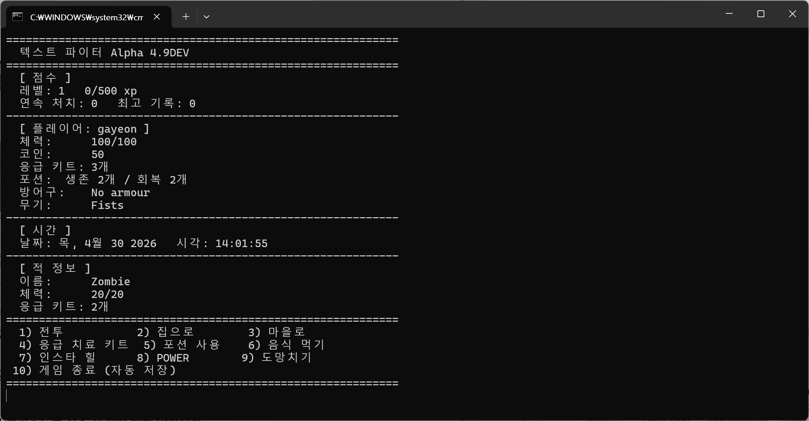
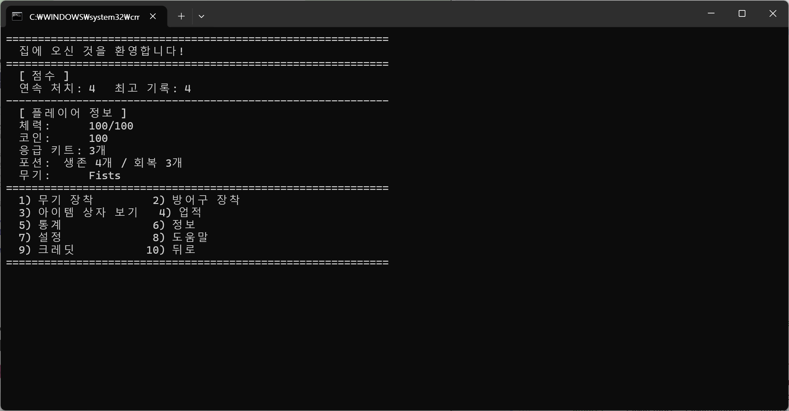
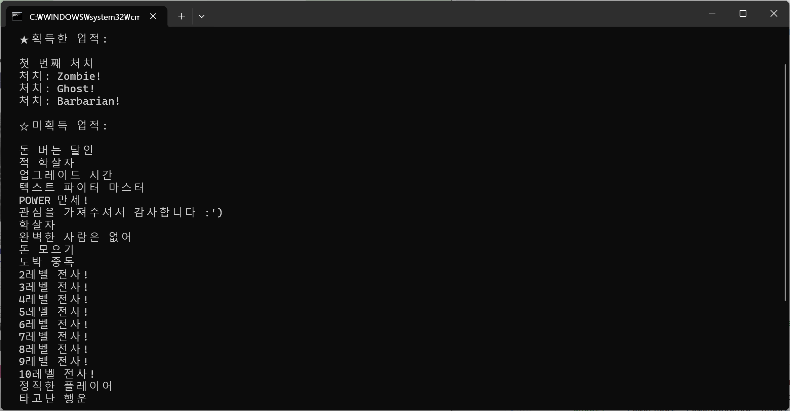
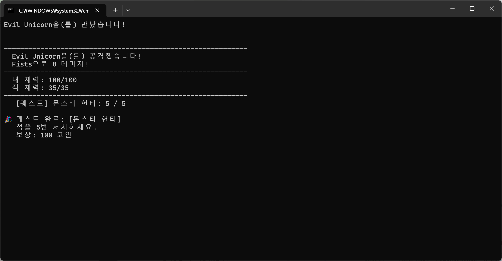
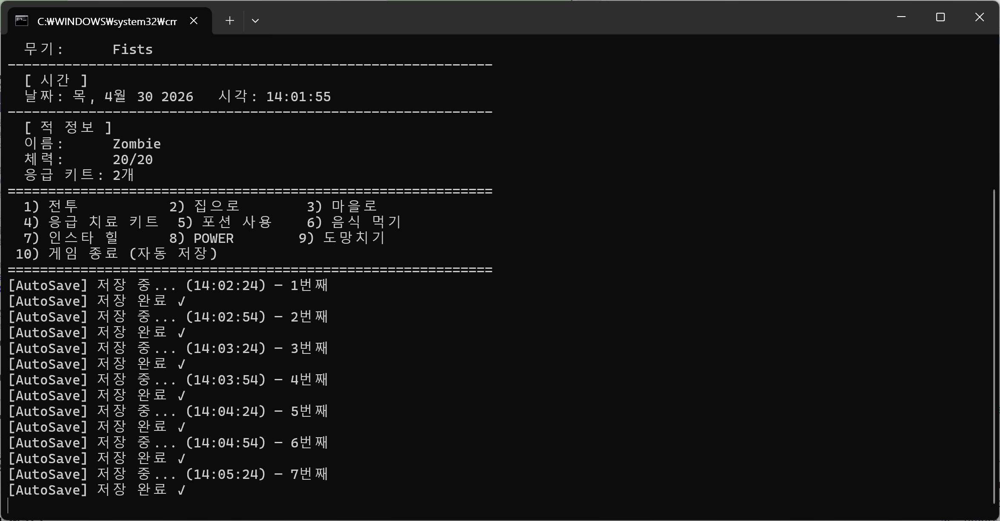
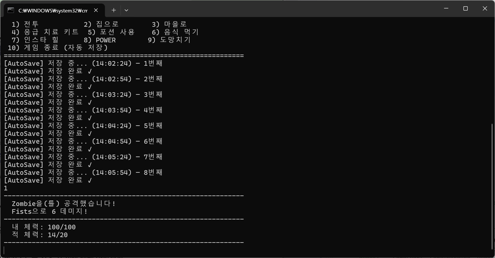

# Text Fighter — 고급 자바 프로그래밍 과제

> 학번: 20231650 &nbsp;&nbsp; 이름: 조가연

---

## 프로젝트명

**Text Fighter** — 텍스트 기반 RPG 전투 게임 (Java)

---

## 프로그램 개요

Text Fighter는 터미널에서 실행되는 텍스트 기반 RPG 게임입니다.

원본 오픈소스 프로젝트를 클론하여, 수업에서 학습한 고급 자바 개념을 직접 설계·구현하였습니다.
기존 코드는 전투 로직, 아이템 관리, 적 생성이 하드코딩으로 뭉쳐 있어 확장과 유지보수가 어려운 구조였습니다.
이를 디자인 패턴, 제네릭, 스트림, 멀티스레드를 활용해 구조적으로 개선하고 새로운 기능을 추가하였습니다.

**원본 프로젝트:** https://github.com/hhaslam11/Text-Fighter

---

또한, 개선된 구조와 설계 패턴을 시각적으로 정리한 다이어그램 페이지(`text_fighter_diagram_fixed.html`)를 claude를 통해 만들어 함께 제공합니다.

## 사용한 주요 자바 개념

| 개념 | 적용 위치 | 설명 |
|------|----------|------|
| 인터페이스 / OOP 심화 | `Item`, `GameObserver`, `EnemyFactory` | 다형성 기반 설계 |
| 제네릭 | `Inventory<T extends Item>` | 타입 안전한 범용 인벤토리 |
| 컬렉션 | `List`, `Map`, `LinkedHashMap` | 아이템/적/로그 관리 |
| 람다 / 스트림 | `BattleAnalyzer`, `EnemyRegistry` | 선언형 데이터 처리 |
| Optional | `EnemyRegistry.create()`, `Inventory.findFirst()` | NPE 없는 안전한 조회 |
| Predicate | `BattleAnalyzer` 칭호 판정 규칙 | 조건 객체 분리 |
| Factory Pattern | `EnemyFactory`, `EnemyRegistry` | 적 생성 로직 분리 |
| Strategy Pattern | `AttackStrategy`, `BattleManager` | 전투 전략 런타임 교체 |
| Observer Pattern | `GameObserver`, `QuestManager` | 퀘스트 이벤트 시스템 |
| Singleton Pattern | `QuestManager`, `GameLogger` | 전역 단일 인스턴스 |
| 멀티스레드 | `AutoSaveTask` | `ScheduledExecutorService` 자동저장 |
| AtomicInteger | `AutoSaveTask.saveCount` | 스레드 안전한 카운터 |
| volatile | `GameLogger.instance` | 멀티스레드 가시성 보장 |
| synchronized | `GameLogger.log()` | 스레드 안전한 로그 기록 |
| enum | `PlayerTitle`, `GameEvent`, `BattleRecord.EventType` | 타입 안전한 상수 관리 |
| 추상 클래스 | `Quest` | 퀘스트 공통 구조 정의 |
| @FunctionalInterface | `EnemyFactory`, `AttackStrategy` | 람다 호환 인터페이스 |

---

## 클래스 구성 설명

```
src/com/hotmail/kalebmarc/textfighter/
│
├── inventory/                  [Step 1] 제네릭 인벤토리
│   ├── Item.java               아이템 인터페이스
│   ├── Inventory.java          제네릭 인벤토리 <T extends Item>
│   ├── PotionItem.java         기존 Potion 래퍼
│   └── FirstAidItem.java       기존 FirstAid 래퍼
│
├── enemy/                      [Step 2] Factory Pattern
│   ├── EnemyFactory.java       @FunctionalInterface
│   └── EnemyRegistry.java      이름→Factory 매핑, 랜덤 생성
│
├── battle/                     [Step 3, 4] Strategy Pattern + 분석
│   ├── AttackStrategy.java     @FunctionalInterface 공격 전략
│   ├── AttackStrategies.java   MELEE / SNIPER / SHOTGUN / CRITICAL
│   ├── BattleManager.java      전략 컨텍스트, 런타임 교체
│   ├── BattleRecord.java       전투 이벤트 수집 + Stream 분석
│   ├── PlayerTitle.java        플레이 스타일 칭호 enum
│   └── BattleAnalyzer.java     Predicate 리스트 + Stream.findFirst()
│
├── quest/                      [Step 5] Observer Pattern
│   ├── GameEvent.java          이벤트 타입 enum
│   ├── GameObserver.java       Observer 인터페이스
│   ├── Quest.java              추상 퀘스트 클래스
│   ├── KillQuest.java          처치 퀘스트
│   ├── CriticalQuest.java      크리티컬 퀘스트
│   └── QuestManager.java       Subject (Singleton + Observer)
│
├── util/                       [Step 6, 7] 멀티스레드 + Singleton
│   ├── AutoSaveTask.java       ScheduledExecutorService 자동저장
│   └── GameLogger.java         Singleton + synchronized 로거
│
└── main/
    └── Game.java               모든 시스템 연동 (수정됨)
```

---

## 실행 방법

### 환경
- Java 21 이상
- Windows 10/11

### ✅ 권장 실행 방법 (배치파일)

저장소 루트에 포함된 배치파일을 더블클릭하면 바로 실행됩니다.

| 파일          | 설명 |
|-------------|------|
| `run.bat` ⭐ | **한글 출력 권장** — 한글 메뉴, 퀘스트, 전투 분석 리포트가 정상 출력됩니다 |
| `run.bat`   | 영어 출력 — 한글이 깨지는 환경에서 사용하세요 |

> **참고:** `실행_한글.bat`은 콘솔 인코딩을 UTF-8(65001)로 설정 후 실행합니다.
> 한글이 깨지는 경우 `run_english.bat`을 사용하세요.

### 개발자 실행 방법 (Gradle)

```bash
./gradlew run
```

### Step별 테스트 실행 (PowerShell)

```powershell
# Step 1 - Inventory<T>
javac "-cp" "build/classes/java/main" "src/com/hotmail/kalebmarc/textfighter/inventory/InventoryTest.java" "-d" "build/classes/java/main"
java "-Dfile.encoding=UTF-8" "-Dstdout.encoding=UTF-8" -cp "build/classes/java/main" com.hotmail.kalebmarc.textfighter.inventory.InventoryTest

# Step 2 - EnemyRegistry
javac "-cp" "build/classes/java/main" "src/com/hotmail/kalebmarc/textfighter/enemy/EnemyRegistryTest.java" "-d" "build/classes/java/main"
java "-Dfile.encoding=UTF-8" "-Dstdout.encoding=UTF-8" -cp "build/classes/java/main" com.hotmail.kalebmarc.textfighter.enemy.EnemyRegistryTest

# Step 3 - BattleManager
javac "-cp" "build/classes/java/main" "src/com/hotmail/kalebmarc/textfighter/battle/BattleManagerTest.java" "-d" "build/classes/java/main"
java "-Dfile.encoding=UTF-8" "-Dstdout.encoding=UTF-8" -cp "build/classes/java/main" com.hotmail.kalebmarc.textfighter.battle.BattleManagerTest

# Step 4 - BattleAnalyzer
javac "-cp" "build/classes/java/main" "src/com/hotmail/kalebmarc/textfighter/battle/BattleRecord.java" "src/com/hotmail/kalebmarc/textfighter/battle/PlayerTitle.java" "src/com/hotmail/kalebmarc/textfighter/battle/BattleAnalyzer.java" "src/com/hotmail/kalebmarc/textfighter/battle/BattleAnalyzerTest.java" "-d" "build/classes/java/main"
java "-Dfile.encoding=UTF-8" "-Dstdout.encoding=UTF-8" -cp "build/classes/java/main" com.hotmail.kalebmarc.textfighter.battle.BattleAnalyzerTest

# Step 5 - QuestManager
javac "-cp" "build/classes/java/main" "src/com/hotmail/kalebmarc/textfighter/quest/GameEvent.java" "src/com/hotmail/kalebmarc/textfighter/quest/GameObserver.java" "src/com/hotmail/kalebmarc/textfighter/quest/Quest.java" "src/com/hotmail/kalebmarc/textfighter/quest/KillQuest.java" "src/com/hotmail/kalebmarc/textfighter/quest/CriticalQuest.java" "src/com/hotmail/kalebmarc/textfighter/quest/QuestManager.java" "src/com/hotmail/kalebmarc/testfighter/quest/QuestManagerTest.java" "-d" "build/classes/java/main"
java "-Dfile.encoding=UTF-8" "-Dstdout.encoding=UTF-8" -cp "build/classes/java/main" com.hotmail.kalebmarc.textfighter.quest.QuestManagerTest

# Step 6+7 - AutoSaveTask + GameLogger
javac "-cp" "build/classes/java/main" "src/com/hotmail/kalebmarc/textfighter/util/AutoSaveTask.java" "src/com/hotmail/kalebmarc/textfighter/util/GameLogger.java" "src/com/hotmail/kalebmarc/textfighter/util/UtilTest.java" "-d" "build/classes/java/main"
java "-Dfile.encoding=UTF-8" "-Dstdout.encoding=UTF-8" -cp "build/classes/java/main" com.hotmail.kalebmarc.textfighter.util.UtilTest
```

---

## 주요 기능 설명

### 1. 제네릭 인벤토리 `Inventory<T extends Item>`

**개선 전:** `FirstAid.firstAid`, `Potion.survivalPotion` 처럼 아이템마다 static 변수로 따로 관리.

**개선 후:** `Inventory<T>` 하나로 통합. Stream으로 검색·정렬·요약, Optional로 NPE 없이 안전 접근.

```java
inventory.findFirst(p -> p.getQuantity() > 0)
         .ifPresentOrElse(Item::use, () -> System.out.println("아이템 없음"));
```

### 2. Factory Pattern — `EnemyRegistry`

**개선 전:** `Game.java`와 `Settings.java` 두 곳에 적을 동시에 추가해야 했습니다.

**개선 후:** `register()` 한 줄로 새 적 추가 완료. Dragon, Skeleton 2마리 신규 추가.

```java
register("dragon", () -> new Enemy("Dragon", 100, 30, 50, 30, 45, 120, 8, 10, true, false));
```

### 3. Strategy Pattern — `BattleManager`

**개선 전:** 전투 로직이 무기별 if/else 하드코딩.

**개선 후:** `setStrategy()`로 전략만 교체. `withBonus()` 고차 함수로 성향 보너스 동적 적용.

```java
battleManager.setStrategy(AttackStrategies.SNIPER);
int damage = battleManager.attack(dmgMin, dmgMax, weaponName);
```

### 4. BattleAnalyzer — Stream/Optional 활용

전투 종료 후 플레이 스타일 분석 → 칭호·총평 부여. `List<Predicate>` + `Stream.findFirst()`로 if/else 없이 판정.

```
╔══════════════════════════════════════╗
║         전투 분석 리포트              ║
╠══════════════════════════════════════╣
║  칭호: 🛡 맞으면서 이기는 스타일       ║
║  전투 효율    : 41.4%                 ║
╚══════════════════════════════════════╝
```

### 5. Observer Pattern — `QuestManager`

`Game.java`에 `notify()` 한 줄만 추가하면 퀘스트 시스템 전체 동작.

```java
questManager.notify(GameEvent.ENEMY_KILLED, Enemy.get().getName());
```

### 6. 멀티스레드 — `AutoSaveTask`

별도 스레드에서 30초마다 자동저장. `AtomicInteger`로 저장 횟수 스레드 안전하게 관리.

```
[AutoSave] 저장 중... (09:54:26) — 1번째
[AutoSave] 저장 완료 ✓
```

### 7. Singleton — `GameLogger`

Double-checked locking + `volatile`로 멀티스레드 환경에서도 안전한 Singleton 구현.

---

## 실행 화면

### 게임 메인 화면 + AutoSave


### 퀘스트 완료


### Step 테스트 출력


### 전투 분석 리포트


### 자동 저장



## 본인이 구현한 부분

원본 프로젝트의 기존 코드(`main`, `player`, `item`, `casino` 패키지)는 수정 없이 유지하였습니다.
아래 패키지 전체를 직접 설계하고 구현하였습니다.

- `inventory/` — Item 인터페이스, Inventory\<T\>, PotionItem, FirstAidItem
- `enemy/` — EnemyFactory, EnemyRegistry (Dragon, Skeleton 신규 적 추가)
- `battle/` — AttackStrategy, AttackStrategies, BattleManager, BattleRecord, PlayerTitle, BattleAnalyzer
- `quest/` — GameEvent, GameObserver, Quest, KillQuest, CriticalQuest, QuestManager
- `util/` — AutoSaveTask, GameLogger
- `main/Game.java` — 전체 시스템 연동, 한글화, Enemy/Weapon getter 추가

칭호(`PlayerTitle`) 문구는 본인이 직접 작성하였습니다.

---

## AI 활용 여부 및 활용 범위 (바이브코딩)

본 프로젝트는 Claude (Anthropic)를 활용한 바이브코딩 방식으로 진행하였습니다.

**설계 단계:**
Claude와 반복적인 대화를 통해 어떤 디자인 패턴을 어디에 적용할지,
기존 코드와 어떻게 연동할지 직접 고민하고 설계 방향을 결정하였습니다.
단순히 제안을 받은 것이 아니라 "왜 이 패턴인가", "기존 코드와 충돌은 없는가"를
스스로 검토하는 과정을 거쳤습니다.

**구현 단계:**
설계한 내용을 바탕으로 Claude를 통해 코드 초안을 생성하였습니다.
생성된 코드는 직접 IntelliJ에서 빌드·실행하며 동작을 확인하였고,
컴파일 오류, 런타임 버그, 인코딩 문제 등을 직접 디버깅하고 수정하였습니다.
AutoSave가 매번 새 파일을 생성하는 버그를 직접 발견하여 수정한 것이 대표적인 예입니다.

**테스트 단계:**
각 Step별 테스트 코드는 Claude로 생성하였으며,
실제 실행 결과를 직접 검토하여 정상 동작 여부를 확인하였습니다.

**문서화:**
README.md는 Claude를 통해 초안을 생성하고,
학번·이름·칭호 문구·실행 환경 등 본인만 알 수 있는 내용을 직접 추가·수정하였습니다.
---


*고급 자바 프로그래밍 | 2026년 1학기*
